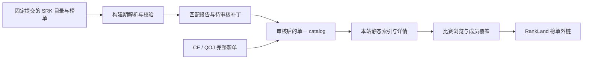

# RankLand 榜单与数据入口迁移计划

日期：2026-09-09。状态：规划完成，尚未实施。用户所述 `rkland` 在本文指 RankLand（algoUX）。

## 目标与范围

将已核验比赛的默认榜单入口迁移到 RankLand，并逐步以 algoUX 的 SRK 合集作为榜单元数据和奖牌线的优先构建期输入。本站继续负责比赛题单、成员覆盖和 VP 前检查。

这里的“数据入口”包括比赛发现、榜单身份、日期及分组、奖牌线及来源证据。CF／QOJ 的补题入口、逐题映射和成员状态仍由现有流程提供。RankLand 不能被假定为完整补题链接合集，也不将队伍现场成绩转换为成员个人已解题状态。

本计划采用消费公开榜单数据的方式，不部署 RankLand 服务，不上传本站目录或成员数据。当前阶段只修改计划文档；实际迁移在后续实现批次进行。

## 审计基线

本地基线：`main` 的 `47cf11e`，catalog 版本 `0.6.0`。

| 项目 | 当前状态 |
| --- | --- |
| 公开目录 | 246 场、3031 题 |
| `kind=standings` 来源记录 | `xcpcio_board` 141 条，`pintia` 3 条；这里统计来源条目，不代表全部比赛的可用榜单数 |
| 已保存奖牌线 | 135 场：XCPCIO 126 场、Codeforces 9 场 |
| 数据匹配 | `scripts/match-xcpcio-board-contests.mjs` |
| 奖牌线获取 | `scripts/fetch-xcpcio-award-cutoffs.mjs`、`scripts/fetch-codeforces-award-cutoffs.mjs` |
| 来源模型 | `web/src/lib/catalog.ts` 中的通用 `CatalogSource`，provider 为字符串 |
| 特定榜单逻辑 | `web/src/lib/xcpcio-board.ts`；目录编辑器内的 provider 选项 |
| 奖牌线展示 | `web/src/views/ContestDetailView.vue`、`ContestListView.vue`；当前来源说明含 XCPCIO medal 配置措辞 |
| 发布方式 | canonical catalog → 预生成索引／详情 → 静态站点；成员数据保存在 IndexedDB |

以上数量为迁移前快照，实施时必须重新生成基线报告。

## 已核验的上游与待核验事项

- [srk-collection](https://github.com/algoux/srk-collection) 提供 `official/config.yaml` 目录树及 SRK 文件，是本计划首选的可版本固定的数据入口。
- [RankLand 项目说明](https://github.com/algoux/rankland-web#rankland-前端) 描述了 `/collection/:id?rankId=`、`/ranklist/:id` 等页面。实际外链必须验证到具体比赛，不能将目录文件名、SRK 内部 ID、RankLand 数据库 ID 当成同一个 ID。
- [SRK 格式仓库](https://github.com/algoux/standard-ranklist) 提供类型和 Schema。实施前需要检查真实样本的版本、分组、奖项、罚时单位和封榜状态；当前尚未完成字段级兼容性验证。
- [XCPC Link 源码](https://github.com/coolarec/xcpc.link) 的导航数据可以作为资源发现辅助；它不是本迁移的榜单主数据源。
- [SRK 合集使用说明](https://github.com/algoux/srk-collection#使用本数据) 要求按许可使用数据，并说明了来源署名及衍生数据的处理方式。落实数据许可说明、归属标记与可追溯的加工记录后再发布导入数据。

上游文档中出现 API 地址不等于已确认稳定公共 API。本期以固定提交的 Git 文件为输入，不依赖未验证的搜索接口、实时接口或页面内部请求。

## 目标数据链路

### 榜单入口

已核验的 RankLand 来源使用 `provider: "rankland"`、`kind: "standings"`，`url` 保存用户可以访问的比赛榜单页面，`source_title` 保存上游标题。沿用现有 `sources` 数组，主标题和内部比赛 ID 不变。

`provider_contest_id` 的具体契约在样本核验后确定：必须是带明确命名空间的稳定上游身份，不能仅取文件 basename。构建期证据同时记录集合名、完整 SRK 路径、提交 SHA、内容哈希和已验证的页面地址。原始 JSON 文件地址与用户榜单地址分开记录。

来源选择规则：人工明确指定的有效来源优先；否则优先已核验 RankLand，再回退到有效的既有榜单。保留其他来源可供查看。奖牌线的来源链接独立显示，不能因为默认榜单入口改了，就把旧奖牌线标成 RankLand 数据。

### 元数据与奖牌线

- 比赛名称、日期和来源变化先进入审核补丁。已有主标题保持稳定，上游名称进入 `source_title` 与别名。
- 同名同城的 ICPC／CCPC 比赛、正式赛／热身赛、跨年赛季、联合省赛必须分别匹配。年份与标题相似度只能作为证据之一。
- 精确已审核映射可以重用；模糊匹配、多个候选、日期冲突、题数冲突都进入人工处理报告。
- SRK 没有完整且可核验的题名和补题映射时，只能补榜单或形成文档候选。严禁据此发布空比赛或仅 A/B/C 占位题。
- 奖牌线仅处理能够解释的最终榜单；确认分组、参评资格、打星排除、奖项含义、并列边界及罚时单位。邀请赛／省赛两个参评组不能简单合并。
- 有明确奖项信息时计算真实奖牌线。无法确认时保留既有可信值，或标记缺失；比例推算必须显式标成估算，不能冒充官方奖项。
- 当前每场仅有一份 `awardCutoffs`。多参评组第一期必须记录经审核的目标组；需要同时展示多个组时另立模型改造任务。
- 复用现有 `awardCutoffs` 消费方式；新证据字段优先使用 `snake_case`。不要趁迁移重命名既有 camelCase 持久化字段。任何模型扩展先更新 Schema、导入导出契约与兼容性说明。

## 分阶段执行

### P0：来源盘点与可行性验证

- [ ] 固定 SRK 上游提交，保存目录与少量真实样本的哈希和抓取时间。
- [ ] 遍历目录配置，不从标题猜测文件路径；只下载试点榜单。
- [ ] 对照全部 catalog 与 2025／2026 TODO，生成已匹配、缺失、歧义、元数据冲突四类报告。
- [ ] 核验 SRK 版本、数据字段、页面链接与再分发要求；统计可迁移榜单数及可可靠计算奖牌线的场次数。

试点选择：2026 网络赛第一场、深圳、浙江、武汉；另用 2025 ICPC／CCPC 南昌验证身份冲突，用 2025 西安验证“有榜单、题单尚缺”的候选处理。是否纳入某份榜单以实际数据为准。

出口：有逐场证据和可复现样本；明确无法覆盖的场次，不预先承诺全量替代 XCPCIO。

### P1：迁移默认榜单入口

- [ ] 新建构建期 RankLand 匹配工具，默认只输出报告；单独 apply 操作只接受已审核映射。
- [ ] 新增 `rankland` 来源，保留有效旧来源及内部 ID；修正已证实的南昌错配。
- [ ] 将前端需要的榜单选择逻辑改为支持多来源的通用函数，检查所有原 helper 调用方。
- [ ] 更新目录编辑器、详情链接与来源标签；本地自定义来源和旧导入文件继续可用。

出口：试点默认链接准确，回退路径可用；除审核允许的来源／别名修正外，原题单和成员覆盖结果不变。

### P2：迁移榜单数据与奖牌线

- [ ] 建立版本受控的 SRK 解析和奖牌线适配器，按审核目标组计算。
- [ ] 对已有奖牌线生成双来源差异报告，列出参评队数、奖牌边界、解题数、罚时及差异原因。
- [ ] 仅提升已确认质量的结果；冲突、不完整或不支持的榜单保留原值并报告。
- [ ] 更新来源说明，清楚区分官方奖项与估算；来源必须指向实际参与计算的数据对应榜单。

出口：试点计算有可核对证据，缺字段和分组不明不会产生貌似成功的结果。

### P3：扩展覆盖与更新流程

- [ ] 按 2026、2025、历史比赛分批迁移，逐批保留映射和差异报告。
- [ ] 提供独立的获取、检查、应用命令；网络获取不进入默认 CI／部署构建。
- [ ] RankLand 作为已迁移比赛的默认刷新来源，旧工具仅处理明确回退场次；防止旧刷新命令覆盖已审核 RankLand 结果。
- [ ] 审核 `catalog:refresh` 的重建行为，验证全部人工补录、CF／QOJ 映射及新来源在重建后保留；在此之前使用增量应用，不能宣称重建安全。
- [ ] 对缺失比赛输出文档候选和 QOJ 导出需求，不自动新增无题单比赛。

出口：每场有明确状态：RankLand 已迁移、保留旧来源、待匹配或冲突。总体完成以所有场次均有处理结论为标准；有数据缺口时不删除旧适配器。

## Schema 设计进度

2026-09-09 已完成 [Schema 设计](rankland-schema-design.md)：来源快照、映射审核、奖牌线审核三个独立契约，以及合成示例和离线验证器。尚未开发 SRK 适配器或 apply，不代表 P0 上游核验已完成。

## 拟新增或修改的文件

以下是实施目标；Schema 设计期文件见上节，其余迁移工具尚未实现。

| 文件／位置 | 用途 |
| --- | --- |
| `scripts/import-rankland-standings.mjs` | 固定快照解析、匹配报告及审核后应用 |
| `scripts/validate-rankland-tools.mjs` | 不依赖网络的解析、映射和奖牌线回归 |
| `fixtures/imports/rankland/` | 少量原始／脱敏或合成 fixture、审核映射与预期结果 |
| `schemas/` | 需要时补充审核映射契约及来源证据字段 |
| `catalog/default-catalog.min.json` | 唯一正式目录；应用审核后的来源与摘要 |
| `web/src/lib/standings.ts` | 拟议的通用榜单来源选择逻辑 |
| 现有来源 helper、目录编辑器、详情页 | 来源兼容、默认入口和奖牌线说明 |
| `package.json`、`scripts/README.md` | 显式更新命令与离线验证入口 |

大体积上游榜单和批量派生报告放在忽略的本地缓存／产物目录，提交固定 revision 的获取清单和必要测试样本；不要把整套 SRK 数据复制入 Git 或前端产物。审核映射是可重放导入材料，catalog 仍是正式数据源。

## 验证与验收

- [ ] Schema：固定支持的 SRK 版本与本项目 Schema 均校验；未知版本、残缺 JSON、未知奖项语义明确失败。
- [ ] 匹配：覆盖同名异赛、跨年、热身赛、联合比赛、多分组、QOJ 版本差异及原榜单错配。
- [ ] 数据保全：迁移前后内部 ID、逐题 CF／QOJ 来源、主标题和成员覆盖结果一致；每项例外有审核记录。
- [ ] 原子性：错误输入不得写入部分 catalog；重复 apply 不产生变化，来源不重复。
- [ ] 奖牌线：覆盖打星排除、缺失奖项、并列名次、罚时单位、封榜／不完整数据以及组别不同的差异。
- [ ] 前端：默认榜单链接、备用链接及真实奖牌线来源分别正确；无 RankLand 映射的比赛仍可浏览。
- [ ] 性能：主页与详情不新增 RankLand／SRK 网络请求，不加载完整历史榜单；维持现有缓存和静态分片方式。
- [ ] 生成：静态资产重复生成哈希一致，`npm run deploy:build` 通过；核查校验确实覆盖新增证据字段。
- [ ] 故障：上游超时、404 或解析失败保留上次已审核数据，并输出失败场次；部署构建可离线使用已提交 catalog。

预期不变更 IndexedDB stores、indexes 或版本。若实施发现必须迁移本地持久化结构，应先补充迁移设计，再改代码。

## 发布与回滚

计划及审核报告入口保留在 `main`。运行时逻辑、必须的工具／Schema／fixture 和 catalog 变更按批同步 `release`。每批发布记录迁移数量、回退数量、冲突数量、验证结果和上游提交。

先发布试点入口，再发布已核验的奖牌线，最后扩大范围。部署前备份站点；上线核对索引、试点详情、榜单外链和奖牌线来源。回滚使用上一版静态产物或回退对应提交，不清空用户 IndexedDB。发生上游源故障时保留最后成功数据，不能把失败快照发布为空目录。

## 首个实施批次的交付物

1. 一份带固定上游提交的全目录匹配报告，以及上述试点的逐场证据。
2. 一组经审核 RankLand 外链映射和通用榜单入口改造。
3. 南昌错配的核验结论；证据不足则保留待办。
4. SRK 真实样本兼容性结论与奖牌线迁移差异报告。
5. 离线回归、部署验证和后续批次清单。
